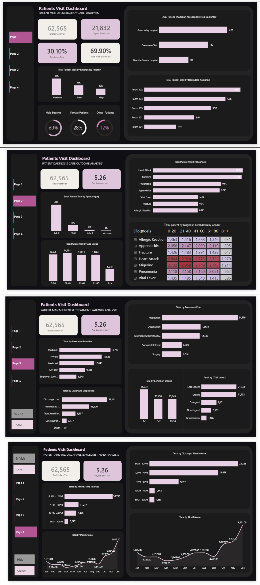

# Patient Visit & Emergency Care Dashboard
**Tools:** Power BI | DAX  
**Type:** Healthcare Analytics Dashboard (4 Pages)
**Industry:** Healthcare

## Project Overview
Built a comprehensive 4-page healthcare analytics 
dashboard analysing 62,565 patient visits across 
3 hospitals with 5.26 average length of stay.

## Dashboard Pages

### Page 1 — Patient Visit & Emergency Care
- Total Patient Visits: 62,565
- Urgent Admissions: 21,832
- Admission Rate: 30.10%
- Non-Admission Rate: 69.90%
- Gender split: Male 60%, Female 28%, Other 12%
- Emergency Priority: Medium 31K, Low 19K, High 12K
- Top room by visits: Room 102
- Fastest avg physician access: Riverside General 
  Hospital at 90 mins vs Green Valley at 210 mins

### Page 2 — Patient Diagnosis & Care Outcome
- Avg Length of Stay: 5.26 days
- Age breakdown: Adult 49K, Child 10K, 
  Infant 2K, Unknown 1K
- Top diagnoses: Heart Attack, Migraine, 
  Pneumonia (9.5K), Appendicitis (9.3K)
- Heart Attack and Migraine highest across 
  41-60 age group

### Page 3 — Patient Management & Treatment
- Top treatment: Medication (24,679 patients)
- Top insurance: Medicare (18,770)
- Majority discharged home: 31,141
- Admitted to hospital: 18,820
- CTAS Level: Less Urgent leads at 21,933

### Page 4 — Arrival, Discharge & Volume Trends
- Peak arrival time: 8AM-12PM (38,733 visits)
- Peak discharge time: 8AM-12PM (28,228)
- Monthly trend shows December peak at 9,361
- January lowest at 1,314

## Skills Demonstrated
- 4 page Power BI dashboard design
- DAX measures and calculations
- Healthcare KPI tracking
- Patient flow analysis
- Diagnosis outcome analysis
- Insurance provider breakdown
- Time series trend analysis

## Dashboard Preview

